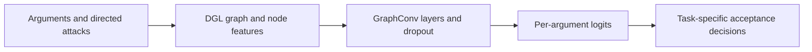

# AFGraphLib: Graph Learning for Abstract Argumentation

[](https://github.com/lmlearning/AFGraphLib/actions/workflows/tests.yml)

Graph-learning components and experimental materials for **predicting which arguments are accepted in a network of arguments and attacks**. The core contains DGL graph construction, acceptance-label utilities, GCN models and inference experiments.

**Start with the runnable GCN example below.** For the pretrained decision-solver workflow, see [AFGCN](https://github.com/lmlearning/AFGCN).

## Run a CPU example

Use Python 3.11 in an activated virtual environment, from the repository root. The pinned CPU environment supports Linux and Windows.

```bash
python -m pip install -r requirements-cpu.txt pytest
python -m examples.gcn_demo
python -m pytest -q tests
```

The example fits the existing `GraphLib.model.GCN` to an illustrative four-argument framework: `a → b → c`, plus an isolated argument `d`. It prints a `[4, 1]` logits shape and a decreasing training loss. This is a small training demonstration with known labels, not a held-out accuracy result. No corpus or checkpoint download is required.

## Architecture and code map



| Path | What to inspect |
| --- | --- |
| [examples/gcn_demo.py](examples/gcn_demo.py) | A complete graph → model → loss → backward-pass example. |
| [GraphLib/model.py](GraphLib/model.py) | Graph convolutional model definitions. |
| [GraphLib/dglutil.py](GraphLib/dglutil.py) | Graph construction and batching helpers. |
| [GraphLib/util.py](GraphLib/util.py) | Framework parsing and acceptance-label utilities. |
| [GraphLib/inference.py](GraphLib/inference.py) | Grounded reasoning and neural-inference experiments. |
| [AFs](AFs/) | Research frameworks and solution files, stored with Git LFS. |
| [AFGCNv2](AFGCNv2/) | Historical competition solver snapshot and its paper. |

The library modules support package imports from the repository root and the original script-style imports from inside `GraphLib`. Older standalone experiment scripts retain their original paths and configurations; the CPU example is the maintained first-run workflow.

## Research context

See [Approximating Problems in Abstract Argumentation with Graph Convolutional Networks](https://www-users.york.ac.uk/peter.nightingale/aij-argumentation-2024.pdf), by Lars Malmqvist, Tangming Yuan and Peter Nightingale, for the research approach and experimental evaluation. A smoke run here does not reproduce those experiments.

Use [CITATION.cff](CITATION.cff) to cite this software, and cite the paper separately when discussing its findings.

## Data and validation

The demo runs without Git LFS. For the research corpus, install Git LFS and fetch the required `AFs/` paths; text files beginning with `version https://git-lfs.github.com/spec/v1` are pointers, not graph data. To keep an initial clone small, set `GIT_LFS_SKIP_SMUDGE=1` before cloning.

CI checks real CPU forward/backward execution, both import styles and device-transfer failure handling. The transfer helper preserves graph identity and keeps the current attribute if conversion fails; earlier successful transfers are not rolled back. Full historical training and GPU execution are separate reproduction tasks.

## Development

Run the tests above before opening a PR. For a bug report, include the smallest framework that reproduces it, the command, package versions and expected versus actual behavior. Keep benchmark changes accompanied by split definitions, seeds and run logs.

## Related projects and license

[AFGCN](https://github.com/lmlearning/AFGCN) · [ExplainableArgGCN](https://github.com/lmlearning/ExplainableArgGCN) · [AFSubsample](https://github.com/lmlearning/AFSubsample)

Code is available under the [MIT license](LICENSE).
